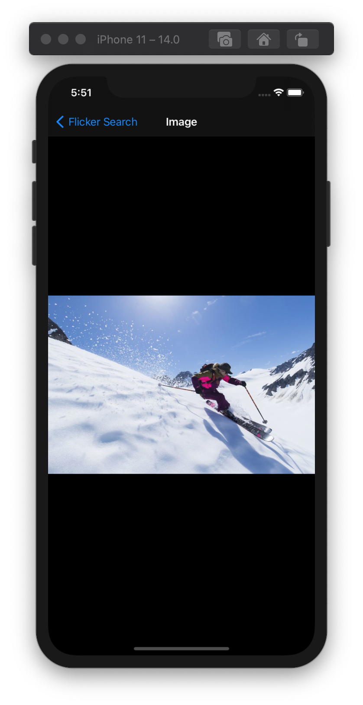
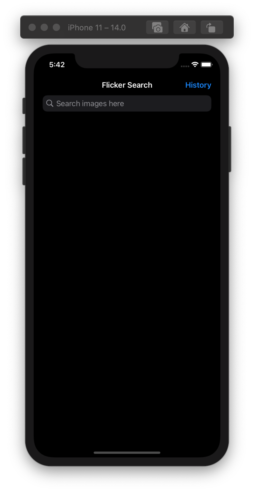
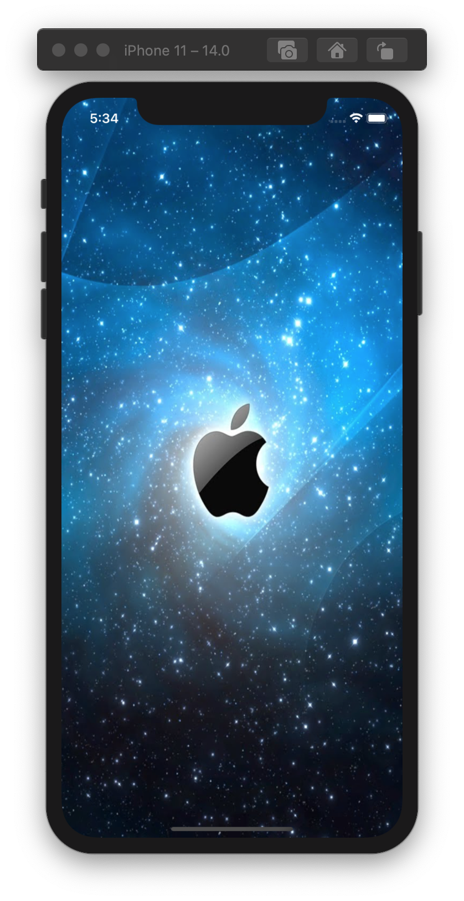
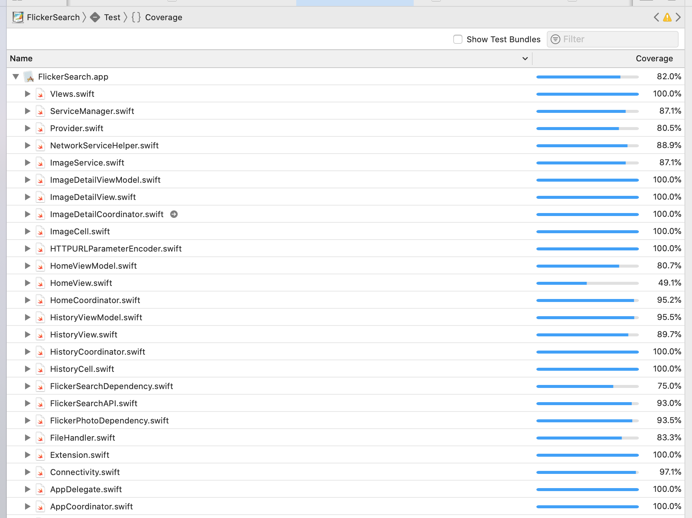

# FlickrSearch
FlickrSearch app shows photos based on user's input and displays the images on home screen with endless scrolling. 
Clicking photo navigates user to next screen where enlarged photo can be seen.
FlickrSearch app also maintains the search history, Search history can be seen by clicking on history button situated on top right.

## Functionality
-  User can see list of photos by entering any search term like "Newyork, Paris, Brad Pitt etc" on search bar. 
-  User can see any photo in large frame in next screen by selecting on it.
-  User can see all the searched item in History View.
-  FlickrSearch app  shows alert in case of error while fetching photos from Network or if there is not network.
- FlickrSearch app is supported in both light and dark modes. 
- FlickrSearch app is supported for portrait mode.
- FlickrSearch app supports searches in online mode and search history in offlinemode.
- FlickrSearch supports iOS version 13.x and above. Tested on iPhone 6, iPhone8, iPhone11 with iOS 13.4 and iOS 14.0.

## Important Points
- FlickrSearch app uses flickrsearch api provided by flickr. 
- FlickrSearch app handles all the error scenario and shows error message accordingly.
- FlickrSearch app uses image caching mechanisum to cache images.

## App Screens

### PreCondition
macbook with XCode 11.x installed. FlickrSearch app has been developed on XCode 11.2.1

## Operating Manual
-  Home screen is shown when app is launched with SearchBar at the top and History button on top right.  
-   To see photos, search can be done by entering words  (E.g.- Newyork, Cristiano etc) inside the search box and on tapping Enter/Search will show the list of photos on the home screen with 2 photos in each row.
-   Photo in large frame can be seen in next screen by tapping on it.. 
- Searched items can be seen in history view by tapping on history button on right top, it will show the list of searched string in 'most recent at the top' manner.

## Technical Details

### Third Party
- No third party library is used.

### Architecture
- MVVM-C Architecture is used in the app.
- All the layers - Application, Presentation, Data, Networking,  are based on protocol oriented design.

### Language
- Swift language has been used.

### Testing 
XCTest for unit testing and manual testing is done for UI.

### Folder Structure
Code is divided into following Groups
- Application  group contains  AppDelegate and  Appcoordinator(decides which screen to show).
- Presentation group contains all the screens that is shown in app, It contains Histoy, Home and Image Detail.
- Networking group contains the file which are responsible for interacting with APIs, It contains sub groups of ImageService, ServiceManager, Dependency, Provider and NetworkServiceHelper.
- Data group is responsible for persistance, It contains FileHandler for read and write operations.
- Utlities contains Constant, Extension, ImageService, Views, Reachability, AlertProtocol . This code is reusable generic code used through out the app.
- Resource group is responsible for all the resoursces required in app like storyboard, asset, info.plist etc.
- History, ImageDetail and Home group contains the modules with their respective view, Collection view cells, ViewModel, Coordinator, Model, Protocols. 
- Home subgroup contains *SearchView* for main Home screen view.  
- History subgroup contains *SearchedHistory Items* for showing the list of recently searched items.
-Image detail subgroup contains *ImageDetail* for showing the selected photo.

### Unit Tests
- Unit test are written and provide a code coverage of 82.0 percent. see the screenshot attached.

### Unit tests Folder Structure:
- Home contains tests written on View, ViewModel, Coordinator.
- History contains tests written on View, ViewModel, Coordinator.
- ImageDetail contains tests written on View, ViewModel, Coordinator.
- Networking subgroup contains tests written on Network Services.
- Mock subgroup contains mock-up classes of HomeCoordinator.

## Built With
- XCode 11.2.1
- Tested on iPhone 8. (iOS 13.1.3)
